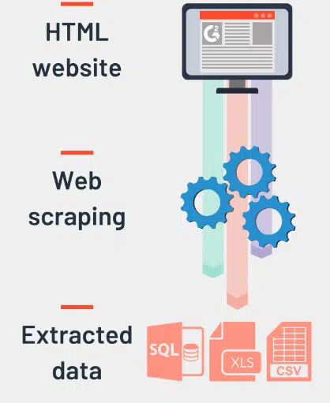
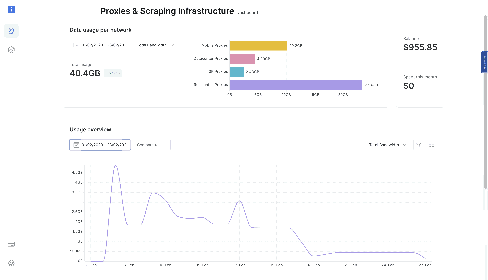
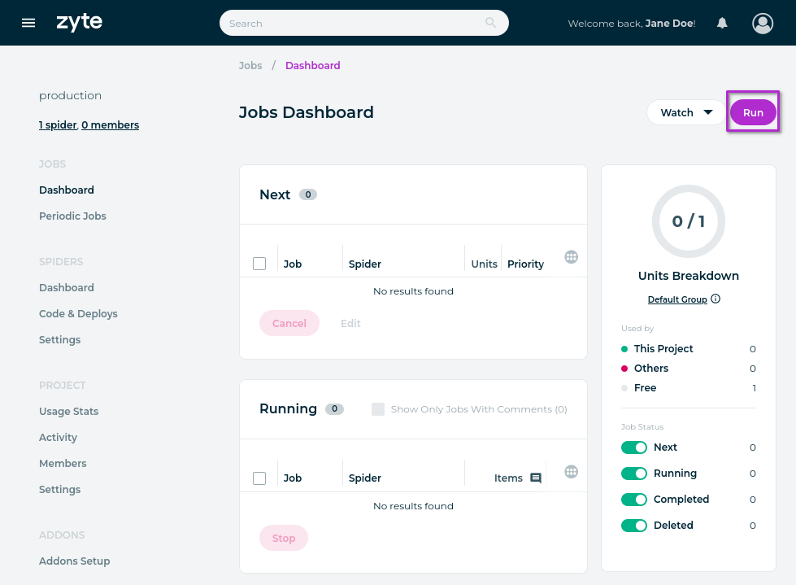
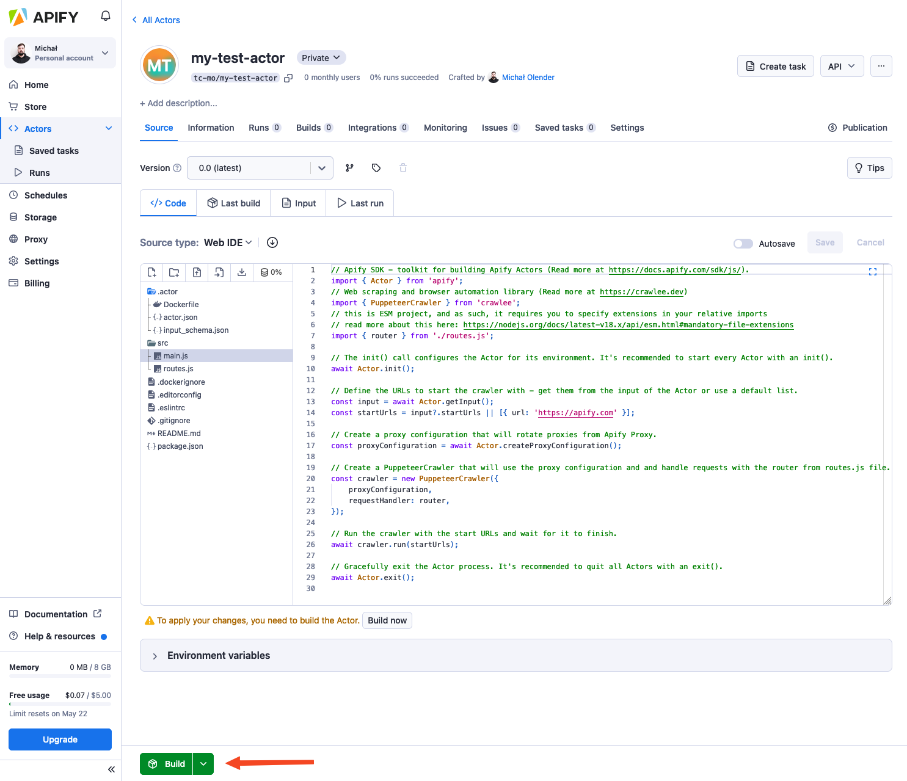

<!-- _color: White-->
<!-- _paginate: skip -->
 
 
 
 

# Ethical Web Scraping
Python Web Scraping
<!--   -->
 
 
 

Rianaditro | 2024

---
<!-- paginate: true -->
## Introduction
Web scraping is an **automated** technique used to **extract data** from websites. It involves using scripts, software, or bots to crawl web pages, collect specific information, and store it in a structured format for further analysis or use.

Technical Synonyms:
- Web Data Extraction
- Web Crawling
- Data Mining

---
## Web Scraping Process

1. Sending an HTTP Request
2. Receiving and Parsing the Response
3. Extracting the Desired Data
4. Storing the Data
5. Automating and Scaling

---

## Where is Web Scraping Skills Needed?
1. E-Commerce & Retail
2. Finance & Investment 
3. Digital Marketing & SEO 
4. Real Estate
5. Media & Journalism
6. Travel & Hospitality

---

## Web Scraping Service Provider
**Octoparse** – A no-code desktop application that enables non-developers to scrape data from websites using a visual, drag-and-drop interface. Best for beginners and small-scale projects.

---

**BrightData** – A robust proxy and web scraping service offering powerful tools for large-scale data extraction, including residential, mobile, and datacenter proxies. Ideal for enterprise-level scraping.

---

**Zyte** – A managed web scraping service that provides high-quality, ready-to-use data using AI-powered extraction. It also offers smart proxy solutions and anti-bot bypassing.

---

**Apify** – A cloud-based web scraping and automation platform that allows developers to create, run, and manage web scrapers using "Actors" (custom scraping scripts). Ideal for automation and large-scale data extraction.

---
## Choosing Web Scraping Provider
For no-code beginners → Octoparse
For managed high-quality data → Zyte
For large-scale scraping & proxy needs → BrightData
For coding & automation → Apify

---
## Web Scraping Cases
- X vs Bright Data (2024): X Corp. sued Bright Data for unauthorized data scraping, but the case was dismissed.
- Meta vs Ekrem Ateş (2022): Meta sued Ateş for scraping Facebook & Instagram, resulting in a **permanent ban and legal injunction**.
- HiQ Labs vs LinkedIn (2017-2023): LinkedIn sued HiQ for scraping public profiles, leading to **years of legal battles** over data ownership. **HiQ filed for bankruptcy**, effectively ending the legal battle.
- Aaron Swartz Case (2011): Swartz faced **35 years in prison & $1M** in fines for scraping academic papers from JSTOR.

---
## Web Scraping Don'ts
**1. Don’t Scrape Data Without Checking Legal & Ethical Boundaries** 
Before scraping, always check:  
✅ **Robots.txt** – contains instructions for web crawlers and bots, specifying which parts of a website they are allowed or disallowed to access and scrape.
✅ **Privacy Laws (GDPR, CCPA, etc.)** –  contain provisions that regulate how personal data can be collected, stored, and used, which directly impacts web scraping activities.

---

**2. Don’t Scrape Personal or Sensitive Data**  
Avoid collecting:  
❌ Usernames, passwords, or login credentials  
❌ Private emails or phone numbers  
❌ Medical records or financial data

Avoid websites:  
❌ Betting/Gambling Websites
❌ Adult Content Websites (Pornographic Sites)
❌ Payment Platforms

---
**3. Don’t Overload a Website’s Server**
Sending too many requests too fast can:  
❌ **Crash the website** (denial of service).  
❌ **Get your IP banned**.  
❌ **Harm the website owner’s business**.  

**Best Practice:**  
✅ Use time delays.
✅ Implement **rate limiting & exponential backoff**.  

---
**4. Don’t Ignore API Alternatives**
Many platforms provide **official APIs**, which are:  
✅ Legal & reliable  
✅ Faster and structured  
✅ Less likely to get blocked

**5. Don’t Scrape Paywalled or Copyrighted Content**
❌ Avoid scraping **premium articles**, **academic papers**, or **licensed content**.  
✅ Instead, check for **public datasets** or **official APIs**.  

---

---
## Web Scraping Career Path
If you're interested in:
- **Web Development**, a natural progression would be to explore roles like **backend developer**. You can focus on building scalable web scraping systems, handling data processing, and integrating APIs to collect valuable information from websites.
- **Data and analysis**, you can aim to become a **data engineer** or **data scientist**. In this role, you'll take the data you scrape and clean it, then analyze it for trends or build predictive models using tools like Pandas and machine learning.

---

- If **automation** excites you, a great option is to dive into **automation engineering**. You'll work on streamlining web scraping processes and building automated workflows to collect data continuously without manual intervention, using tools like Selenium or Puppeteer.

- If you're leaning toward **business and marketing**, you can look into **lead generation**, **market research** or becoming a **web scraping consultant**. In these roles, you'll apply web scraping to gather data for market research, competitor analysis, and lead generation. You’ll also need to ensure that the scraping is compliant with privacy laws like GDPR.

---
## Class Activity
List all the possible challenges you may encounter when performing web scraping, along with potential solutions. (15 minutes)

---
## Reflection
Apart from the existing web scraping companies, how do you plan to compete with them?

---
## Exploration
Apify offers a platform where you can provide web scraping and automation services to clients worldwide. As a freelancer, you can build and sell custom scrapers, automate data extraction tasks, and collaborate with businesses in need of structured data. Check out more details and get started here: [Apify Freelancer Program](https://apify.com/partners/freelancers).

---
<!-- _backgroundColor: grey -->
<!-- _color: white -->
<!-- _paginate: false -->
 
 
 
 

# Thank you
Any Question?
<!--   -->
 
 
 

Kampus Remote Worker Indonesia | 2024

