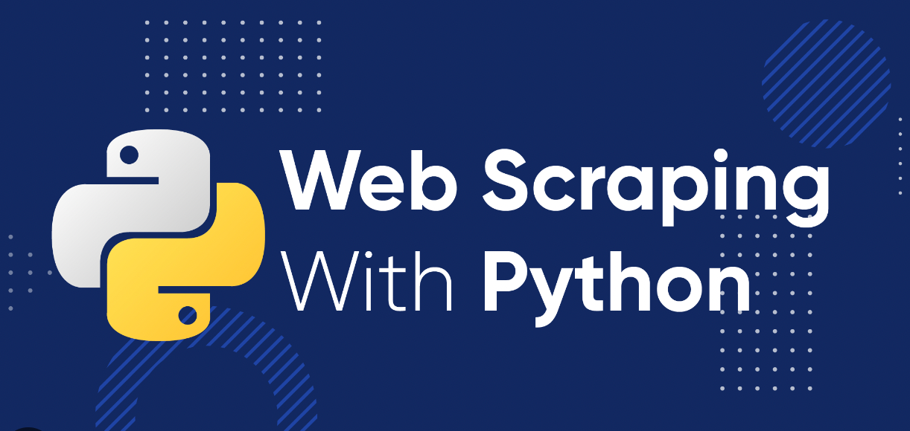

# Python Web Scraping Course
Welcome to the **Python Web Scraping Course** brought to you by **Remote Worker Indonesia**! In this course, you will learn how to collect data from websites for further use. Whether you're looking to enhance your coding skills or become a proficient web scraper, this course will guide you step-by-step.

### Course Overview:
This course covers the following topics:

**Module 0: Pre-Class - Starter for Non-IT Learners**  
This introductory module helps you understand the basics of web scraping as a career, its applications, and freelancing opportunities. You will also learn fundamental concepts such as networking, internet protocols, and APIs to build a strong foundation for the course.  

**Module 1: Fundamental Programming**  
This module focuses on problem-solving techniques and algorithmic thinking essential for software engineering. You will engage in quizzes and exercises to develop your ability to analyze problems, conduct self-research, and create efficient solutions.  

**Module 2: Basic Web Development**  
A foundational understanding of HTML and CSS is essential for web scraping. In this module, you will learn how web pages are structured and how to analyze their components for data extraction.  

**Module 3: Python Fundamentals**  
Python is the primary language for web scraping. This module covers Python syntax and core programming concepts. If you already have Python experience, you can skip directly to the project.  

**Module 4: Static Web Scraping**  
This module introduces ethical web scraping and fundamental techniques for extracting data from static web pages using Python libraries.  

**Module 5: API Scraping**  
APIs allow direct access to structured data without parsing HTML. In this module, you will learn how to interact with APIs and extract data efficiently.  

**Module 6: Dynamic Web Scraping**  
Modern websites often load content dynamically using JavaScript. This module teaches you how to extract such data using browser automation tools.  

**Module 7: Python Intermediate**  
This module introduces essential Python modules and techniques to improve your efficiency in web scraping projects.  

**Module 8: Python Advanced**  
Advanced Python concepts, including performance optimization, Object-Oriented Programming (OOP), and data transformation using pandas, are covered in this module.  

**Module 9: Bypassing Anti-Bot Techniques**  
Websites implement anti-scraping technologies to block bots. In this module, you will learn techniques to overcome these restrictions.  

**Module 10: Advanced Web Scraping (Under Development)**  
This module expands your skills beyond website scraping by introducing document scraping, chat platform data extraction, and more.  

**Module 11: Deployed Solutions (Under Development)**  
This module covers project deployment, ensuring your web scraping solutions remain functional, scalable, and accessible.  

**Module 12: Beyond Web Scraping (Under Development)**  
In this module, you will explore additional skills related to automation, data processing, and other advanced techniques to enhance your expertise.  

**Module 13: Remote Work & Freelancing (Under Development)**  
The final module focuses on building your personal brand as a remote web scraping professional, helping you secure freelance jobs and remote work opportunities.  

### **Course Format**  
✅ **Introduction Topic** – Understand key concepts and how they fit into the course.  
✅ **Coding Practice** – Apply concepts through hands-on exercises.  
✅ **To-Do (Assignments)** – Complete tasks to reinforce real-world application.  
✅ **Quizzes** – Test your understanding and solidify learning.  
✅ **Reflection** – Summarize key takeaways and insights.  
✅ **Exploration** – Dive deeper into topics and expand your knowledge.

---

### Is This Course Right for You?
This course is ideal for you if:  
✅ You have **no prior coding experience** but are eager to learn. This course starts from the basics but gradually covers advanced topics. Even if you have prior coding experience, you may find new insights in later modules.  
✅ You enjoy working with **data and the web** and want to explore how to gather information programmatically.  
✅ You’re passionate about learning new skills and are **ready to compete with global talent** in the digital space.

### Prerequisites:
- Ability to **self-learn** and troubleshoot.
- A **laptop** and a reliable **internet connection**.
- Estimated learning time: ~400 hours (varies based on learning pace and prior experience). You can learn at your own speed.

---

### Where to Start:
#### If You’re a Beginner
- **Sign up on GitHub**: You will need a GitHub account to follow along with the course materials.
- **Fork the repository**: Once you're logged into GitHub, fork this repository to your own account. Check out [this guide](https://docs.github.com/en/pull-requests/collaborating-with-pull-requests/working-with-forks/fork-a-repo) on how to fork and manage repositories.
- **Download the course files**: After forking, download the repository in ZIP format and extract it to your computer.
- **Open with Visual Studio Code**: Open the extracted files in Visual Studio Code (VS Code).
- **Install Python & required libraries**: Before starting, make sure Python is installed on your computer. You will also need to install some Python libraries listed in the requirements.txt file.

    ```
    pip install -r requirements.txt
    ```

- **Starting with the Pre-Class Module**:
Begin with module **00_pre-class** if you’re new to coding.
This module will cover fundamental concepts like Python basics, web scraping, networking, APIs, and more.

Important: Refer to external resources for learning the basics:
- [CodeCombat](https://codecombat.com/)
- [CodeMonkey](https://www.codemonkey.com/)
- [W3Schools Python Tutorial](https://www.w3schools.com/python/default.asp)
- [Python Beginners Guide](https://wiki.python.org/moin/BeginnersGuide/NonProgrammers)


#### If You Have Coding Experience:
If you're familiar with Python or web development, you can skip the beginner modules and start directly from Module **03_python_fundamentals**.

Review the modules at your own pace, and don't hesitate to skip to advanced topics if you feel confident.

---
### Learning Guidelines
- **Take Your Time**: This course is designed to be flexible, so go at your own pace. Consistent practice is key to mastering web scraping and Python.
- **Collaborate**: Share your learning experiences with others. Create study groups, discuss challenges, and share tips with your peers.
- **Review**: Send a Pull Request upon completion of each module for grading. This helps us monitor your progress and provide feedback. It's mandatory if you’re asking for **Upwork First Timer**.
- **Keep Up-to-date**: We are constantly working to improve the course and the repository. Please regularly check this repository to keep synch.

---

### Problem-Solving Approach:
- **Self-Research**: If you face challenges, try to find solutions on your own by searching online. This is a critical skill for remote work.
- **Ask for Help**: If you're stuck or need clarification, feel free to ask during the scheduled Zoom sessions or ask through Discord.
- **Avoid Over-Reliance on AI**: While AI tools can be useful, they can also limit your problem-solving abilities. We recommend relying on your own research and thinking through the problems before asking for help.

---

### Feedback and Contributions:

If you have any suggestions or feedback:
- **Create an issue on GitHub** to share your thoughts. Please be as clear and detailed as possible to help us understand your feedback.

---

### Career Path in Web Scraping

By the end of this course, you'll be well on your way to starting a successful career in web scraping and remote work. Here’s a potential career path for you to follow:

1. **Backend Developer**  
   **Skills required**: Strong Python, web frameworks (Flask, Django), databases (SQL, NoSQL).  
   **Job tasks**: Develop server-side applications, build APIs, work with databases, and integrate data scraping into web applications.  

2. **Automation Engineer**  
   **Skills required**: Python, automation frameworks (Selenium, Playwright), test automation, cloud platforms.  
   **Job tasks**: Automate processes, including web scraping, web testing, and data extraction tasks. Integrate automation solutions into business systems.  

3. **Data Engineer**  
   **Skills required**: Advanced Python, SQL, cloud platforms, large-scale data processing, integration with APIs and databases.  
   **Job tasks**: Process and structure large datasets, build pipelines for automated data collection and analysis.  

4. **AI / Machine Learning Engineer (with Web Scraping Expertise)**  
   **Skills required**: Knowledge of Python libraries (Pandas, NumPy, TensorFlow), data analysis, and web scraping to gather data for ML models.  
   **Job tasks**: Collect data through web scraping to train machine learning models, preprocess data, and optimize learning algorithms.  

5. **Remote Work as a Full-Time Web Scraping Engineer**  
   **Skills required**: A deep understanding of web scraping frameworks, data storage, cloud computing, and efficient code practices.  
   **Job tasks**: Handle end-to-end scraping solutions for businesses, manage servers, and scale scraping tasks for long-term projects.  

---

### Tips for Optimal Learning

Learning web scraping, Python, and related tools requires focus and perseverance. Here are some strategies to help you stay on track and make the most out of your learning experience:

1. **Set Clear Goals** – Break the course into manageable tasks and track progress.  
2. **Stay Consistent** – Dedicate regular study time; short, frequent sessions work best.  
3. **Minimize Distractions** – Find a quiet space and take structured breaks (e.g., Pomodoro Technique).  
4. **Reflect on Your Learning** – At the end of each week, reflect on what you’ve learned, the challenges you’ve faced, and how you’ve overcome them.
5. **Ask Questions and Get Involved** – Join discussions, seek help, and share your learning.  
6. **Stay Motivated** – Celebrate small wins and keep your long-term goals in mind.  
7. **Be Patient** – Learning takes time; step back when stuck and keep going.  

---

We’re here to support you in becoming a skilled web scraper and remote professional. Keep learning, stay consistent, and build projects that demonstrate your expertise! 🚀

